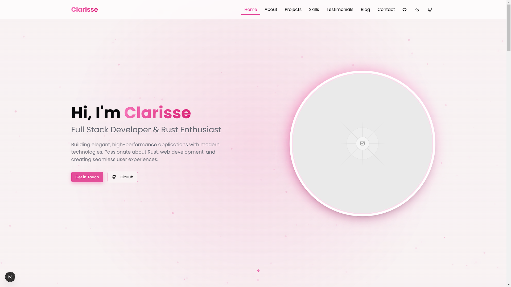
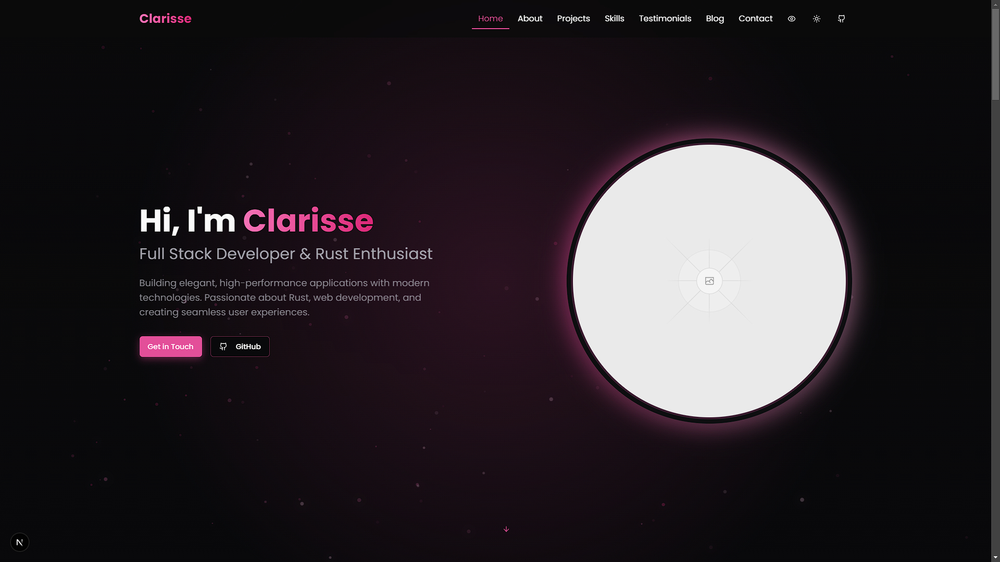
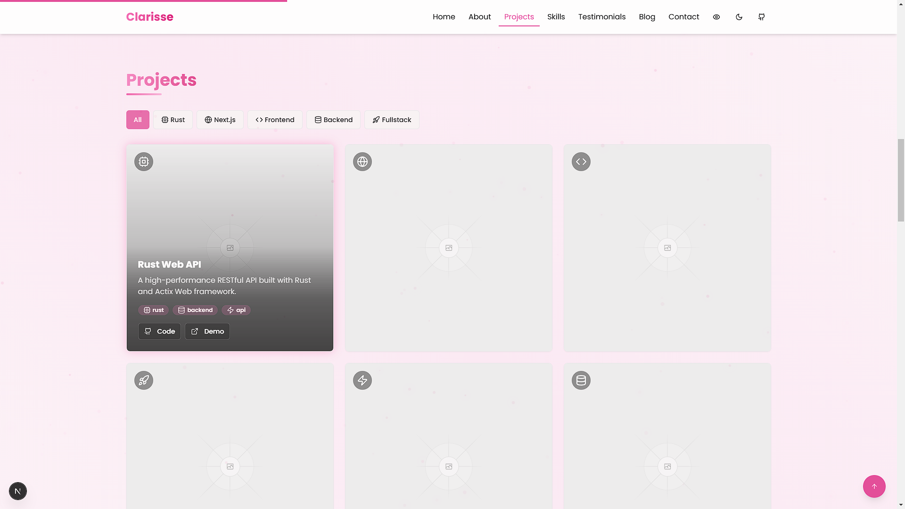
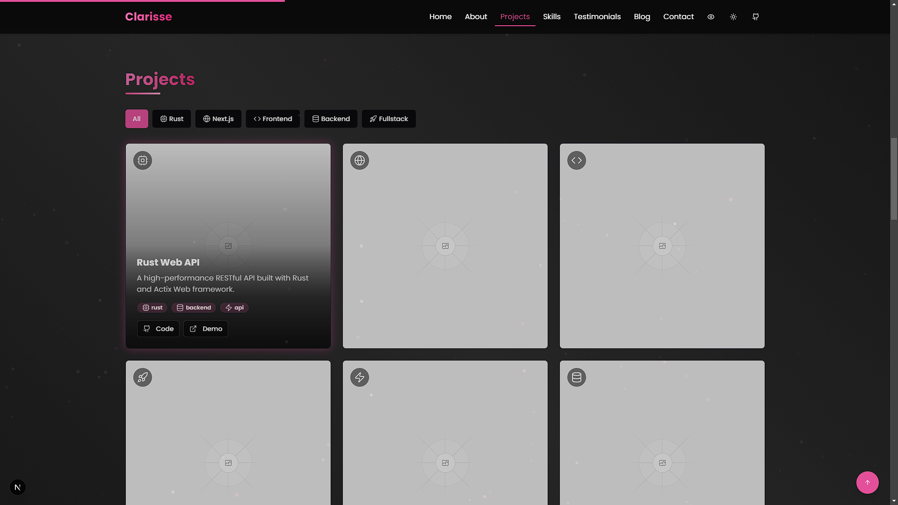

# Clarisse Portfolio

 

A modern, customizable, and responsive portfolio template built with **Next.js** and **TypeScript**. Designed to showcase your skills, projects, and personality with a sleek interface, animated background, and professional features.

---

## Badges

[](https://nextjs.org/)
[](https://www.typescriptlang.org/)
[](https://tailwindcss.com/)
[](https://github.com/voxdroid/clarisse-portfolio/blob/main/LICENSE)
[](https://github.com/voxdroid/clarisse-portfolio)
[](https://github.com/voxdroid/clarisse-portfolio/issues)
[](https://github.com/voxdroid/clarisse-portfolio/commits/main)
[](https://github.com/voxdroid/clarisse-portfolio/releases)

---

## Table of Contents

- [Features](#features)
- [Screenshots](#screenshots)
- [Getting Started](#getting-started)
- [Usage](#usage)
- [Customization](#customization)
- [Project Structure](#project-structure)
- [Built With](#built-with)
- [Dependencies](#dependencies)
- [Releases](#releases)
- [Key Features Explained](#key-features-explained)
- [License](#license)
- [Acknowledgments](#acknowledgments)
- [Contact](#contact)
- [Contributing](#contributing)
- [Support](#support)

---

## Features

- Light/Dark Mode: Toggle between light and dark themes seamlessly.
- Fully Customizable: Adjust colors, fonts, and content to match your brand.
- Responsive Design: Optimized for mobile, tablet, and desktop devices.
- Animated Background: Dynamic particle animations for visual appeal.
- Smooth Animations: Powered by Framer Motion for fluid transitions.
- Modular Components: Well-organized, reusable component structure.
- Interactive UI: Includes tooltips, hover effects, and engaging elements.
- SEO Optimized: Built with search engine visibility in mind.
- High Performance: Fast load times and optimized assets.
- Skills Visualization: Dynamic representation of your expertise.
- Blog Section: Share articles and insights.
- Testimonials: Display feedback from clients or peers.
- Contact Form: Easy way for visitors to reach out.

---

## Screenshots

| Feature            | Light Mode                          | Dark Mode                          |
|--------------------|-------------------------------------|------------------------------------|
| Home Page          |  |  |
| Projects Section   |  |  |
| Skills Section     |  |  |

---

## Getting Started

Set up and run the portfolio locally with these steps.

### Prerequisites

- **Node.js**: Version 18.0 or higher
- **Package Manager**: `npm` or `yarn`

### Installation

1. **Clone the Repository**
   ```bash
   git clone https://github.com/VoxDroid/Clarisse-Portfolio
   ```

2. **Navigate to the Project Directory**
   ```bash
   cd Clarisse-Portfolio
   ```

3. **Install Dependencies**
   ```bash
   npm install
   # or
   yarn install
   ```

4. **Start the Development Server**
   ```bash
   npm run dev
   # or
   yarn dev
   ```

5. Open **[http://localhost:3000](http://localhost:3000)** in your browser to view the portfolio.

---

## Usage

Once the portfolio is running, you can explore and customize it to suit your needs. Below are key sections and how to use them effectively.

### Getting Started
- Launch the development server as described above.
- Navigate the site via the browser to preview the default layout and content.
- Use the customization options below to personalize it.

### Hero Section
- **Purpose**: Introduce yourself with a striking headline and background animation.
- **How to Use**: Edit `components/hero.tsx` to update your name, tagline, and image.

### Projects Section
- **Purpose**: Showcase your work with interactive filters and project cards.
- **How to Use**: Add projects to `components/projects.tsx` (see [Adding Projects](#adding-projects)) and test the filters in the browser.

### Skills Section
- **Purpose**: Visualize your skills dynamically.
- **How to Use**: Update the skills list in `components/skills.tsx` with your expertise.

### Settings (Theme Toggle)
- **Purpose**: Switch between light and dark modes.
- **How to Use**: Test the toggle in `components/theme-toggle.tsx` via the UI; no additional setup needed.

---

## Customization

Tailor the template to reflect your personal style and content.

### Changing Colors
Modify the color scheme in `tailwind.config.ts`:

```typescript
// tailwind.config.ts
const config = {
  theme: {
    extend: {
      colors: {
        primary: {
          DEFAULT: "hsl(330, 73%, 60%)", // Customize here
          foreground: "hsl(330, 10%, 95%)",
        },
      },
    },
  },
};
```

Adjust CSS variables in `app/globals.css`:

```css
:root {
  --primary: 330 73% 60%; /* Light mode */
}

.dark {
  --primary: 330 73% 70%; /* Dark mode */
}
```

### Updating Content
Edit these files to update your information:
- Hero: `components/hero.tsx`
- About: `components/about.tsx`
- Projects: `components/projects.tsx`
- Skills: `components/skills.tsx`
- Testimonials: `components/testimonials.tsx`
- Blog: `components/blog.tsx`
- Contact: `components/contact.tsx`

### Adding Projects
Add projects to the `projects` array in `components/projects.tsx`:

```typescript
const projects = [
  {
    title: "Sample Project",
    description: "A brief overview of the project.",
    image: "/images/sample-project.jpg",
    tags: ["React", "TypeScript"],
    github: "https://github.com/voxdroid/sample-project",
    demo: "https://sample-project-demo.com",
    icon: <CodeIcon className="h-6 w-6" />,
  },
  // Add more projects here
];
```

### Customizing Particle Background
Tweak the animation in `components/particles-background.tsx`:

```typescript
const particleCount = Math.min(120, Math.floor((window.innerWidth * window.innerHeight) / 9000));
const colors = [
  "rgba(236, 72, 153, 0.5)", // Adjust colors
  "rgba(219, 39, 119, 0.5)",
];
```

---

## Project Structure

```plaintext
clarisse-portfolio/
├── app/                    # Next.js app directory
│   ├── globals.css         # Global styles
│   ├── layout.tsx          # Root layout
│   └── page.tsx            # Home page
├── components/             # Reusable React components
│   ├── about.tsx           # About section
│   ├── blog.tsx            # Blog section
│   ├── contact.tsx         # Contact form
│   ├── hero.tsx            # Hero section
│   ├── navbar.tsx          # Navigation bar
│   ├── particles-background.tsx # Animated background
│   ├── projects.tsx        # Projects showcase
│   ├── skills.tsx          # Skills visualization
│   ├── testimonials.tsx    # Testimonials display
│   └── theme-toggle.tsx    # Theme switcher
├── public/                 # Static assets (images, etc.)
├── styles/                 # Additional CSS
├── tailwind.config.ts      # Tailwind CSS configuration
├── tsconfig.json           # TypeScript configuration
└── package.json            # Dependencies and scripts
```

---

## Built With

- [Next.js](https://nextjs.org/) - React framework for production-grade apps
- [TypeScript](https://www.typescriptlang.org/) - Typed JavaScript for reliability
- [Tailwind CSS](https://tailwindcss.com/) - Utility-first CSS framework
- [Framer Motion](https://www.framer.com/motion/) - Animation library
- [Lucide Icons](https://lucide.dev/) - Consistent icon set
- [shadcn/ui](https://ui.shadcn.com/) - Reusable UI components

---

## Dependencies

To run this project, the following Node.js packages are required (listed in `package.json`):
- `next` - Core framework
- `react` and `react-dom` - React libraries
- `typescript` - Type checking
- `tailwindcss` - Styling
- `framer-motion` - Animations
- `@lucide/react` - Icons
- Various `shadcn/ui` dependencies (e.g., `@radix-ui/*`)

Install them with:
```bash
npm install
```

---

## Releases

- Check the [Releases page](https://github.com/voxdroid/clarisse-portfolio/releases) for versioned updates.
- Each release includes notes on new features, bug fixes, and improvements.
- The source code is the primary distribution method; no pre-built binaries are provided.

---

## Key Features Explained

### Animated Particle Background
A semi-transparent particle system moves diagonally, customizable in `components/particles-background.tsx`.

### Interactive Project Filters
Category filters with animated icons and glow effects, implemented in `components/projects.tsx`.

### Custom Tooltip System
Toggleable tooltips managed in `context/tooltip-context.tsx` for enhanced interactivity.

### Responsive Design
Mobile-first design ensures compatibility across devices, built into all components.

---

## License

This project is licensed under the [MIT License](LICENSE). See the license file for details.

---

## Acknowledgments

- [shadcn/ui](https://ui.shadcn.com/) - Reusable UI components
- [Lucide Icons](https://lucide.dev/) - Beautiful icon library
- [Framer Motion](https://www.framer.com/motion/) - Smooth animations
- [Tailwind CSS](https://tailwindcss.com/) - Efficient styling
- [Next.js](https://nextjs.org/) - Robust framework

---

## Contact

Questions or feedback? Reach out:

- **GitHub**: [@VoxDroid](https://github.com/VoxDroid)

---

## Contributing

Contributions are welcome! To contribute:
1. Fork the repository: [https://github.com/VoxDroid/Clarisse-Portfolio](https://github.com/VoxDroid/Clarisse-Portfolio)
2. Create a feature branch (`git checkout -b feature-name`)
3. Commit your changes (`git commit -m "Add feature"`)
4. Push to the branch (`git push origin feature-name`)
5. Open a pull request

See [CONTRIBUTING.md](CONTRIBUTING.md) for more details (Coming Soon).

---

## Support

If you find this project useful, consider supporting its development:

- **Ko-fi**: [Buy me a coffee](https://ko-fi.com/izeno)  
  [](https://ko-fi.com/izeno)
- **Star the Repository**: Give it a star on [GitHub](https://github.com/voxdroid/clarisse-portfolio)  
- **Report Issues**: Submit bugs or suggestions on the [Issues page](https://github.com/voxdroid/clarisse-portfolio/issues)

---

**Developed by VoxDroid**  
[GitHub](https://github.com/VoxDroid) | [Ko-fi](https://ko-fi.com/izeno)
